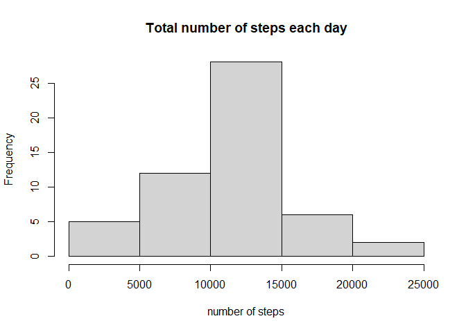
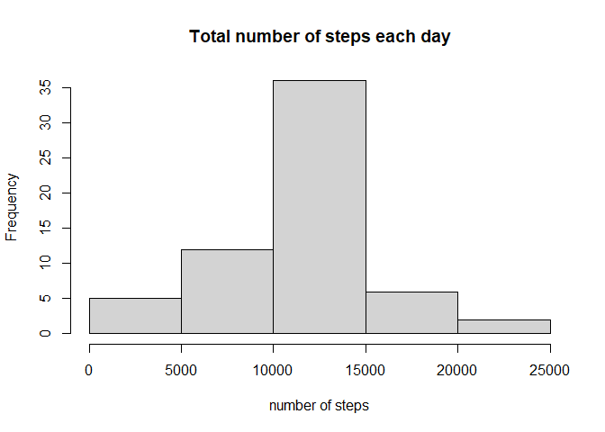

It is now possible to collect a large amount of data about personal movement using activity monitoring devices such as a Fitbit, Nike Fuelband, or Jawbone Up. These type of devices are part of the “quantified self” movement – a group of enthusiasts who take measurements about themselves regularly to improve their health, to find patterns in their behavior, or because they are tech geeks. But these data remain under-utilized both because the raw data are hard to obtain and there is a lack of statistical methods and software for processing and interpreting the data.

We are going to make use of data from a personal activity monitoring device. This device collects data at 5 minute intervals through out the day. The data consists of two months of data from an anonymous individual collected during the months of October and November, 2012 and include the number of steps taken in 5 minute intervals each day.

We are now going to read the data 


```r
library(xtable)
setwd("C:/Users/EpicPineapple/Desktop/RepData_PeerAssessment1")
data <- read.csv("activity.csv")
print(head(data))
```

```
##   steps       date interval
## 1    NA 2012-10-01        0
## 2    NA 2012-10-01        5
## 3    NA 2012-10-01       10
## 4    NA 2012-10-01       15
## 5    NA 2012-10-01       20
## 6    NA 2012-10-01       25
```

We see that this data set has 3 variables which are:

* **steps:** Numberof steps taking in a 5-minute interval (missing values are coded as *NA*
* **date:** The date on which the measurement was taken in *YYYY-MM-DD* format
* **interval:** Identifier for the 5-minute interval in which measurement was taken

Now let's see how many steps have been taken every day


```r
#aggregating steps across each day by sum
newdata <- aggregate(steps ~ date, data, sum)

hist(newdata$steps, 
     xlab = "number of steps",
     ylab = "Frequency",
     main = "Total number of steps each day"
     )
```

<!-- -->

As we can see from the histogram, most days have a total number of steps ranging from 10000 to 15000 steps.

Now let's take a look at the mean number of steps taken per day.


```r
print(mean(newdata$steps))
```

```
## [1] 10766.19
```

And similarly, let's take a look at the median number of steps.


```r
print(median(newdata$steps))
```

```
## [1] 10765
```

Now we will see the average daily activiry pattern.


```r
library(ggplot2)

#aggregating the data across each interval by mean
newdata2 <- aggregate(steps ~ interval, data, mean)
g <- ggplot(newdata2, aes(interval,steps))
g + geom_line()
```

<!-- -->

As we can see from the plot, the 5-minute interval which coincides with the maximum number of steps seems to be somewhere between the 550 and 1000 mark, but let's find out that exact interval.


```r
max <- max(newdata2$steps)
print(subset(newdata2, steps==max)$interval)
```

```
## [1] 835
```

Now let's turn our attention towards *NA* values, we'll first count how many are there in the dataset, then we'll try to impute those *NA* values.

First, let's see how many missing values are there.


```r
count <- 0
for(i in 1:length(data$steps)){
    if(is.na(data$steps[i])){
        count <- count+1
    }
}
count
```

```
## [1] 2304
```

So we can see that there are 2304 *NA* values in the data set, now we'll impute them by replacing them with the mean value for their 5-minute interval calculated before.


```r
for(i in 1:length(data$steps)){
    if(is.na(data$steps[i])){
        data$steps[i] <- subset(newdata2, interval==data[i,]$interval)$steps
    }
}
```

Let's check whether the *NA* values have been indeed removed


```r
count <- 0
for(i in 1:length(data$steps)){
    if(is.na(data$steps[i])){
        count <- count+1
    }
}
count
```

```
## [1] 0
```

So indeed, there are no *NA* values in the altered dataset! Now let's take a look at the new dataset.


```r
print(head(data))
```

```
##       steps       date interval
## 1 1.7169811 2012-10-01        0
## 2 0.3396226 2012-10-01        5
## 3 0.1320755 2012-10-01       10
## 4 0.1509434 2012-10-01       15
## 5 0.0754717 2012-10-01       20
## 6 2.0943396 2012-10-01       25
```

Now we see that all the missing values have been indeed replaced with the mean value for their respective interval.

Let's see what changed! we'll recreate our histogram with the new dataset to see the changes occured by our modification.


```r
newdata <- aggregate(steps ~ date, data, sum)
hist(newdata$steps, 
     xlab = "number of steps",
     ylab = "Frequency",
     main = "Total number of steps each day"
     )
```

<!-- -->

As we can see there's indeed a significant change, as now the number of steps ranging between 10000 and 15000 occurs in 35 days, which is 10 days more than we previously calculated.

Now we'll see whether the activity level changes between weekdays and weekends.


```r
#creating a new variable (day) which takes up the weekdays
data$day <- weekdays(as.POSIXct(data$date))

#going through the data frame to change the value of the newly created day variable to either weekday or weekend
for (i in 1:length(data$date)){
    if (data$day[i] %in% c("Saturday","Sunday")){
        data$day[i] <- "weekend"
    }
    else{
        data$day[i] <- "weekday"
    }
}

#aggregating the steps across each interval and day by mean
dataw <- aggregate(steps ~ interval + day, data, mean)
g <- ggplot(dataw, aes(interval,steps,group=1))
g + facet_grid(dataw$day~.) + geom_line()
```

<!-- -->

